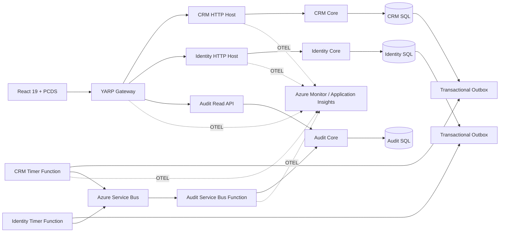

# Project Chicago

Project Chicago is a documentation-first reference implementation for a **lightweight CRM** built around three business concepts:

**Clients → Projects → Tasks**

The functional model is intentionally small. The engineering model is intentionally production-grade: authenticated access, server-side authorization, complete business auditability, cradle-to-grave distributed tracing, durable asynchronous processing, SQL Server/Azure SQL persistence, and a React user experience built from the local Project Chicago Design System (PCDS).

> **Repository state:** the documentation describes the target architecture and the ordered SCRUB implementation path. Do not confuse a design document with deployed behavior. The implementation is built incrementally by running the micro-prompts in `docs/prompts/project-chicago-scrub-microprompts.md`.

## Start here

| If you want to… | Read |
|---|---|
| Understand the product | [`docs/requirements/lightweight-crm-product-and-system-requirements.md`](docs/requirements/lightweight-crm-product-and-system-requirements.md) |
| Understand the architecture | [`docs/design/high-level-design.md`](docs/design/high-level-design.md) |
| See the proposed solution layout | [`docs/PROPOSED-SOLUTION-STRUCTURE.md`](docs/PROPOSED-SOLUTION-STRUCTURE.md) |
| Understand architecture decisions | [`docs/adr/README.md`](docs/adr/README.md) |
| Implement the system with Claude Code | [`docs/prompts/project-chicago-scrub-microprompts.md`](docs/prompts/project-chicago-scrub-microprompts.md) |
| Learn the recurring implementation patterns | [`docs/developer/patterns/README.md`](docs/developer/patterns/README.md) |
| Trace one request end-to-end | [`docs/tracing-a-slice-create-a-client.md`](docs/tracing-a-slice-create-a-client.md) |
| Navigate all documentation | [`docs/README.md`](docs/README.md) |

## Architecture at a glance



The **Crm / Identity / Audit catalog is the recommended initial bounded-context design and remains gated by ADR-0015 until formally accepted**. The architecture rules that are already fixed—YARP-only browser edge, SQL Server database-per-service, Functions for asynchronous entry points, transactional outbox/inbox, ASP.NET Core Identity, local PCDS, and OpenTelemetry—are documented separately in accepted ADRs.

## Technology baseline

- .NET 10 / ASP.NET Core
- .NET Aspire
- Azure Functions isolated worker
- Azure Functions Flex Consumption in production
- Microsoft SQL Server / Azure SQL
- Azure Service Bus
- ASP.NET Core Identity
- YARP
- OpenTelemetry
- Azure Monitor / Application Insights
- React 19 + TypeScript + Vite
- Tailwind CSS v4
- Project Chicago Design System (PCDS), copied into the repository

## Service shape

Every bounded service follows the same three-project structure:

```text
ProjectChicago.<Service>/
ProjectChicago.<Service>.Core/
ProjectChicago.<Service>.Functions/
```

The HTTP host and Functions project are entry points. Business behavior lives in `.Core` and follows:

```text
Controller / Function
        ↓
      Facade
        ↓
     Business
        ↓
       Data
        ↓
   Repository
        ↓
    DbContext
```

No layer skips inward. No service reads another service's database.

## Messaging and audit path

A request-path mutation never publishes directly to Service Bus.

```text
HTTP request
  → business transaction
  → state + outbox record commit together
  → timer-triggered Function drains outbox
  → Azure Service Bus
  → ServiceBusTrigger Function
  → persistent inbox/idempotency
  → consumer business behavior
```

Audit events use the same durable path. Technical logs are **not** the business audit trail.

## Observability principle

Project Chicago must allow an operator to start with a support/reference identifier and follow an operation from browser-facing request to database, outbox, Function, Service Bus, consuming Function, and downstream database. OpenTelemetry provides the common instrumentation model; Azure Monitor/Application Insights is the production single pane of glass.

## AI-assisted implementation

`CLAUDE.md` and `.claude/` contain the standing engineering constraints. The implementation sequence in `docs/prompts/` uses SCRUB—**Scope, Constraints, Restrictions, Usage, Behavior**—with one small, testable action per prompt.

Run prompts **one at a time and in order**. Architecture gates at the beginning must be resolved before dependent implementation prompts are executed.

## Documentation philosophy

Design documents describe the intended system. ADRs record decisions. Developer guides explain how to work within those decisions. Pattern documents explain recurring mechanics. Requirements define product behavior. Prompts implement the requirements. When these disagree, stop and resolve the conflict rather than letting code silently choose.

## License

Use the repository's root license if/when one is added. Until then, no additional license is implied by these documentation files.
