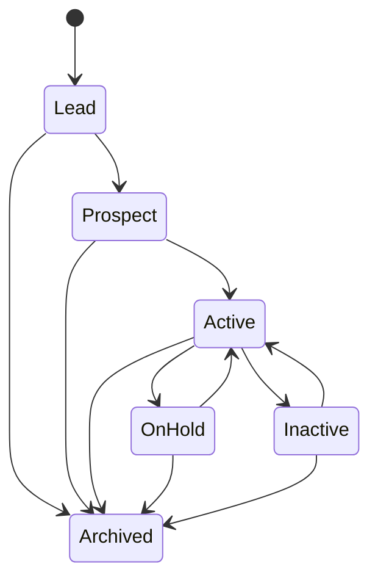

# Project Chicago — Domain Model

## Aggregate shape

Project Chicago's initial CRM model is deliberately compact:

```text
Client
└── Project(s)
    └── Task(s)
```

A Project cannot exist without one Client. A Task cannot exist without one Project. The database enforces these relationships in addition to application validation.

## Client

A Client represents an organization or individual with a business relationship.

### Lifecycle



The diagram illustrates plausible paths, not an authorization to invent transition rules. The exact allowed transition matrix must be defined/approved in business code/tests from the requirements. Every lifecycle change is audited.

Statuses:
- Lead
- Prospect
- Active
- On Hold
- Inactive
- Archived

Key invariants:
- stable enumeration-resistant public identifier,
- searchable name,
- owner reference,
- created/modified UTC,
- optimistic concurrency,
- archive rather than normal hard delete,
- a Client with active Projects cannot be permanently removed,
- duplicate detection warns; it does not silently merge.

## Project

Every Project belongs to exactly one Client.

Statuses:
- Planned
- Active
- On Hold
- Completed
- Cancelled
- Archived

Priorities should be represented by an explicit approved finite set rather than arbitrary free text.

Completion:
- records actual completion UTC,
- if open Tasks remain, the user must explicitly acknowledge before completing,
- does not silently complete open Tasks.

Archival is non-destructive.

## Task

Every Task belongs to exactly one Project and therefore one Client through that relationship.

Statuses:
- Backlog
- To Do
- In Progress
- Blocked
- Completed
- Cancelled

Priorities:
- Low
- Normal
- High
- Critical

Key behavior:
- assignment/reassignment is auditable,
- priority change is auditable,
- completion records completion UTC,
- completed Tasks can be explicitly reopened by authorized users,
- overdue = due date/time passed while not Completed or Cancelled.

## Cross-cutting record metadata

Mutable CRM records should include:
- created UTC / created by,
- modified UTC / modified by,
- optimistic concurrency token/version,
- archive state where applicable.

Backend persistence uses UTC. Presentation converts to user timezone.

## Audit facts versus domain entities

AuditEntry, OutboxMessage and InboxMessage are supporting technical/audit constructs, not CRM business entities.

A successful mutation produces a business audit fact containing enough information to answer:
- what changed,
- when,
- who,
- prior/new value where applicable,
- originating trace/correlation,
- source service.

Sensitive credentials/tokens are never audit values.

## Identity references

CRM records reference application users by stable identity identifiers but do not read IdentityDb directly. Validation/authorization of user references must follow the accepted cross-service identity design rather than a foreign database key.
