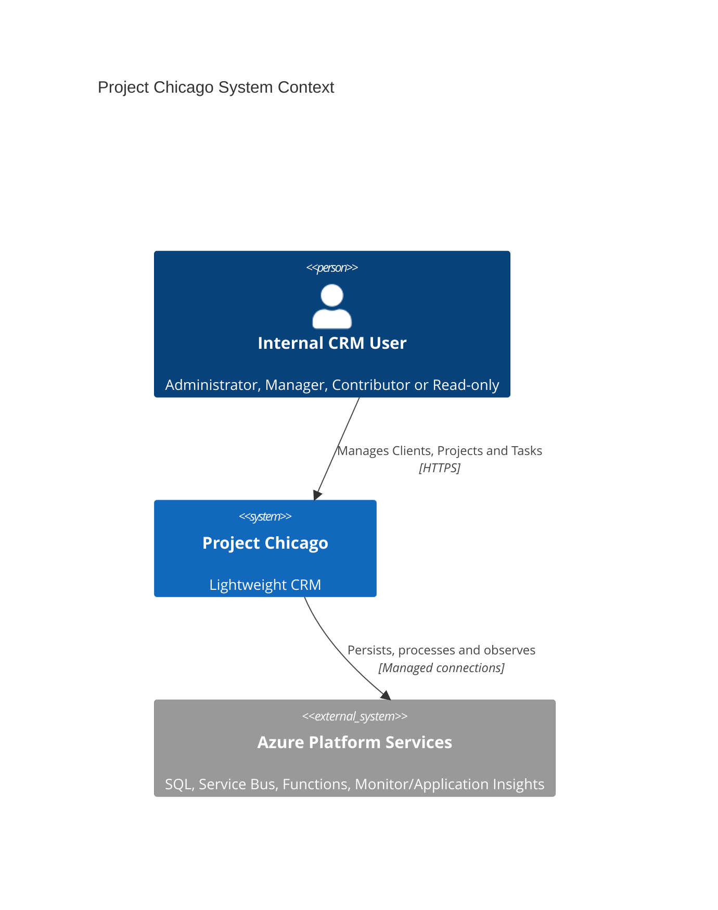
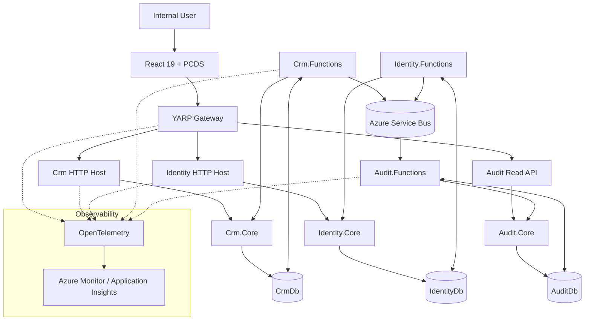
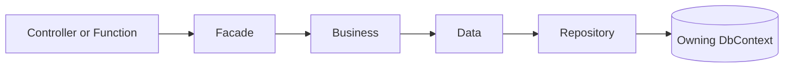
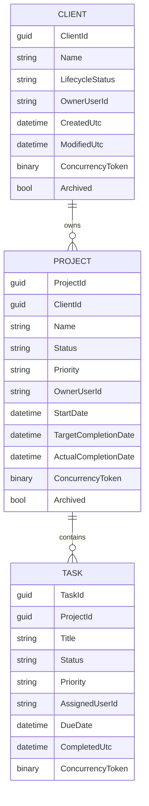
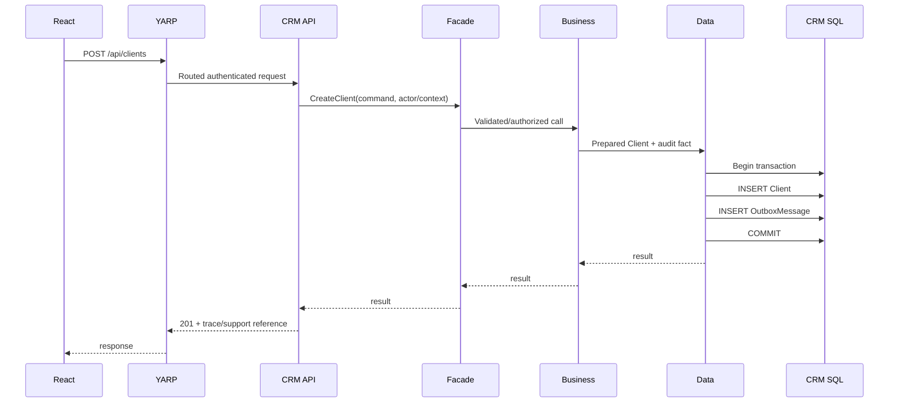
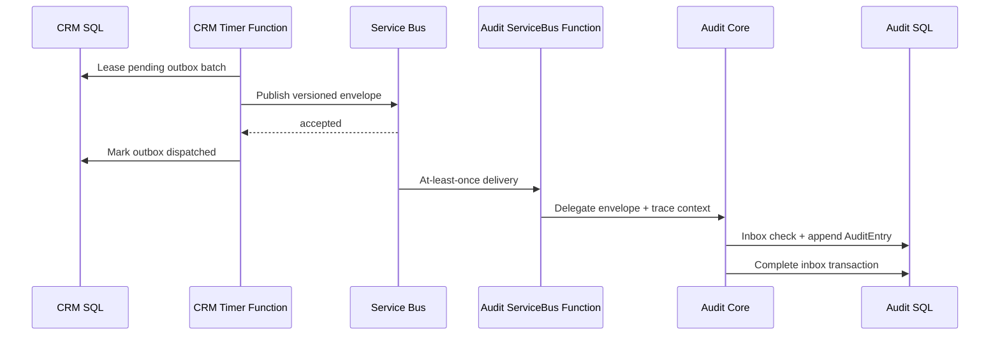

# Project Chicago — High-Level Design

**Status:** Living target design  
**Primary sources:** product/system requirements, `CLAUDE.md`, accepted ADRs, canonical SCRUB micro-prompts.

## 1. Purpose

Project Chicago is a lightweight CRM for tracking Clients, the Projects performed for them, and Tasks required to deliver those Projects. The product intentionally avoids enterprise-CRM sprawl while requiring enterprise-grade security, auditability and observability.

## 2. Goals

- Give internal users a simple Client → Project → Task workflow.
- Keep service ownership explicit and persistence isolated.
- Authenticate with ASP.NET Core Identity and authorize every protected backend operation.
- Make every meaningful mutation auditable.
- Trace requests and asynchronous work from cradle to grave.
- Make failures diagnosable through one observability plane.
- Use durable at-least-once messaging without dual-write data loss.
- Keep the React UI consistent and accessible through local PCDS.

## 3. Non-goals

Initial scope does not include sales opportunities, quotes, invoices, payments, marketing automation, support ticketing, product catalogs, resource planning, time tracking, contract/document management, workflow designers, AI assistants or external customer portals.

## 4. Architecture drivers

| Driver                  | Architectural response                                                           |
| ----------------------- | -------------------------------------------------------------------------------- |
| Lightweight product     | Keep Clients/Projects/Tasks together in the recommended CRM bounded context      |
| Strong data ownership   | SQL database per bounded service; no cross-service SQL                           |
| Auditability            | Immutable business audit events delivered durably to proposed Audit context      |
| Cradle-to-grave tracing | W3C/OTel + CorrelationId/CausationId across HTTP, SQL, outbox, bus and Functions |
| Security                | ASP.NET Core Identity + server authorization + least privilege                   |
| Operational simplicity  | YARP single edge; Aspire local orchestration; common ServiceDefaults             |
| Async reliability       | transactional outbox, timer Functions, Service Bus, persistent inbox             |
| UI consistency          | local PCDS + React 19/TypeScript/Tailwind v4                                     |

## 5. System context

## 6. Container view

The recommended bounded-context catalog is shown below and remains **Proposed** until ADR-0015 is accepted.

## 7. Recommended bounded contexts

### Crm — Proposed

Owns Client, Project and Task state, lifecycle/status transitions, assignment, dashboard and global search over CRM-owned data.

### Identity — Proposed

Owns ASP.NET Core Identity users, roles and account/authentication operations. Authentication transport remains a separate decision.

### Audit — Proposed

Owns append-only durable audit entries and privileged audit/support queries. It is fed asynchronously rather than through cross-database writes.

## 8. Internal service layering

Facade handles use-case validation/context/authorization orchestration. Business owns rules and model translation. Data owns transactions. Repository owns SQL-facing mechanics.

## 9. Data model

See [Domain Model](domain-model.md) for exact requirement-defined states and invariants.

## 10. Request flow

## 11. Asynchronous publication and audit

## 12. API edge

The browser communicates only with YARP. Gateway routes are stable public contracts and internal host names/ports come from service discovery/configuration. Gateway is not a data/business layer.

## 13. Security

- ASP.NET Core Identity supplies identity primitives.
- Protected endpoints require server-side authorization.
- Roles: Administrator, Manager, Contributor, ReadOnly.
- Resource scope checks remain in the service use-case boundary.
- Managed identity is preferred for Azure resource access.
- Secrets/tokens/passwords never enter logs/audit.
- Browser session/token transport is not decided until ADR-0018.

See [Security Design](security-design.md).

## 14. Observability

Automatic instrumentation covers ASP.NET Core, HTTP clients, SQL/EF, Service Bus and Functions. Custom spans cover meaningful business actions, not every method.

Every hop carries or links:

- TraceId / SpanId,
- CorrelationId,
- CausationId,
- event/message ID when async,
- safe service/version/environment metadata.

See [Observability Design](observability-design.md).

## 15. Error handling

Public APIs use consistent ProblemDetails-style responses. Production responses never expose stack traces or infrastructure internals. Validation, 401, 403, 404, concurrency conflict and 5xx are distinguishable. Unexpected errors include a safe support/trace reference.

## 16. Reliability

- bounded retries only for transient operations,
- idempotent message consumers,
- persistent inbox,
- dead-letter visibility,
- cancellation propagation,
- optimistic concurrency,
- bounded result sets/pagination,
- health/readiness signals.

## 17. Known design gates

The following are intentionally unresolved until their ADRs are accepted:

1. exact initial bounded-context catalog,
2. Audit retention/redaction details,
3. Service Bus topology,
4. browser authentication/session transport,
5. production Azure SQL hosting topology,
6. infrastructure-as-code approach/deployment ownership.

The implementation prompts stop at these gates rather than silently inventing answers.
