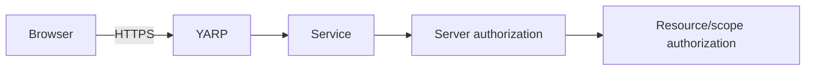

# Project Chicago — Security Design

## Objectives

Project Chicago applies authentication, authorization and least privilege as architecture boundaries rather than UI features.

## Identity baseline

ASP.NET Core Identity is accepted for:
- application users,
- password hashing/storage,
- roles,
- lockout/account primitives,
- password change/reset primitives as approved.

The system never implements custom password hashing.

## Roles

Initial roles:
- **Administrator** — user/role administration plus broad CRM/audit access.
- **Manager** — manage authorized Clients/Projects/Tasks.
- **Contributor** — work within authorized CRM scope, especially Tasks.
- **ReadOnly** — read authorized data; no mutations.

Role names alone do not replace resource-level authorization. A Manager may still need an owner/scope check.

## Browser authentication decision gate

The precise browser session/token transport is **not yet accepted**. ADR-0018 must resolve:
- cookie/session vs access-token model,
- CSRF strategy,
- browser storage,
- logout/revocation,
- token/session lifetime,
- gateway role,
- downstream trusted identity propagation,
- 401 vs 403 behavior.

Do not implement a transport merely because it is the default generated by a template.

## Gateway trust boundary

YARP is the only browser-facing backend edge. Internal services are not public browser endpoints. Functions are asynchronous entry points, not public APIs.

## Authorization rules

- Authentication/authorization enforced server-side.
- Every protected operation has an explicit policy or equivalent authorization rule.
- Mutation authorization is checked before state change.
- Search/dashboard results are trimmed to authorized scope.
- UI role-based hiding is only a usability affordance.
- 401 = not authenticated; 403 = authenticated but not permitted.

## Azure resource access

Use managed identity wherever supported. Grant least privilege:
- service database access only to owning service identities,
- Service Bus Send to publisher relay Functions,
- Service Bus Listen to consumer Functions,
- Key Vault access only to required principals,
- no broad shared credentials.

## Secrets

Never commit:
- connection strings with credentials,
- client secrets,
- tokens,
- passwords,
- private keys.

Production secrets/configuration use approved Azure configuration/Key Vault mechanism.

## Logging, telemetry and audit privacy

Never write passwords, access/refresh tokens, connection strings or cryptographic secrets into:
- structured logs,
- trace attributes,
- metrics,
- audit entries.

PII is included only when necessary and explicitly approved. Prefer stable IDs over names/emails in telemetry.

## API security

Input validation occurs before business mutation. APIs protect against broken access control, injection, object reference problems, excessive data exposure, CSRF where relevant, authentication failures and security misconfiguration.

ProblemDetails is safe-by-default; production responses never reveal stack traces/database/broker internals.

## Security verification

Release review includes:
- route-by-route auth matrix,
- 401/403 behavior,
- role/resource policy tests,
- search/dashboard trimming,
- direct-service exposure check,
- secret scan,
- sensitive-log review,
- gateway-only browser dependency check.
